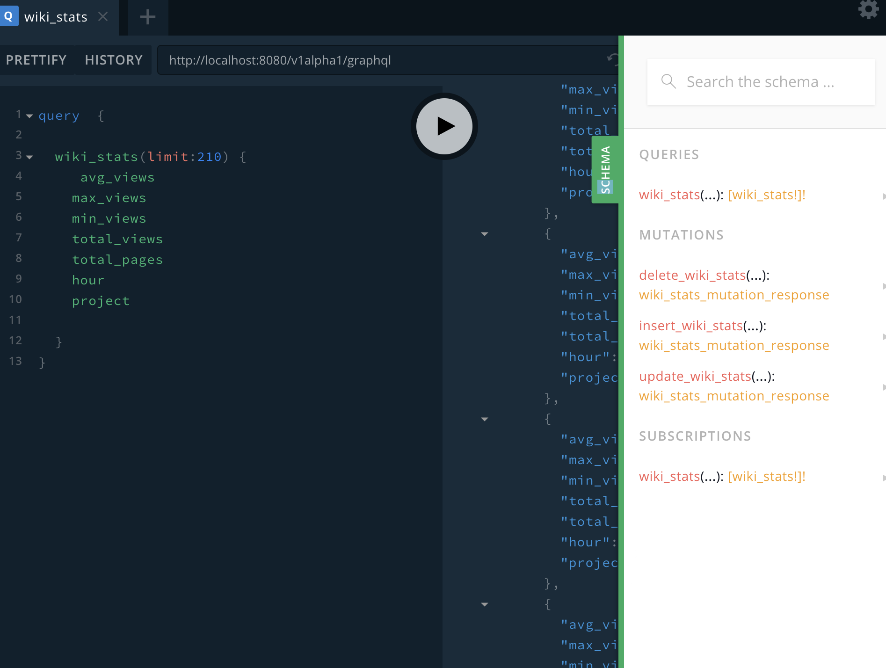
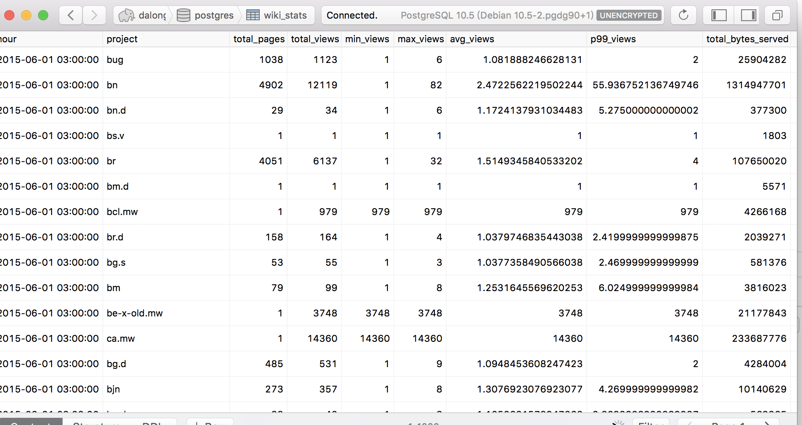
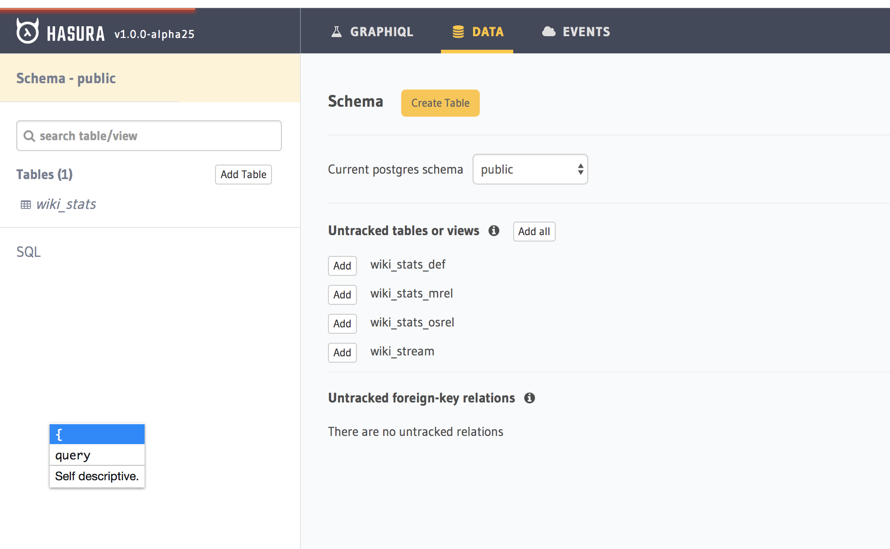

# pipelinedb 1.0.0 with hasura graphql-engine

## How to Run

* create stream && view

```code
CREATE FOREIGN TABLE wiki_stream (
        hour timestamp,
        project text,
        title text,
        view_count bigint,
        size bigint)
SERVER pipelinedb;
CREATE VIEW wiki_stats WITH (action=materialize) AS
SELECT hour, project,
        count(*) AS total_pages,
        sum(view_count) AS total_views,
        min(view_count) AS min_views,
        max(view_count) AS max_views,
        avg(view_count) AS avg_views,
        percentile_cont(0.99) WITHIN GROUP (ORDER BY view_count) AS p99_views,
        sum(size) AS total_bytes_served
FROM wiki_stream
GROUP BY hour, project;
```

* import data from web

```code
curl -sL http://pipelinedb.com/data/wiki-pagecounts | gunzip | \
        psql -c "
        COPY wiki_stream (hour, project, title, view_count, size) FROM STDIN"
```

* some images



